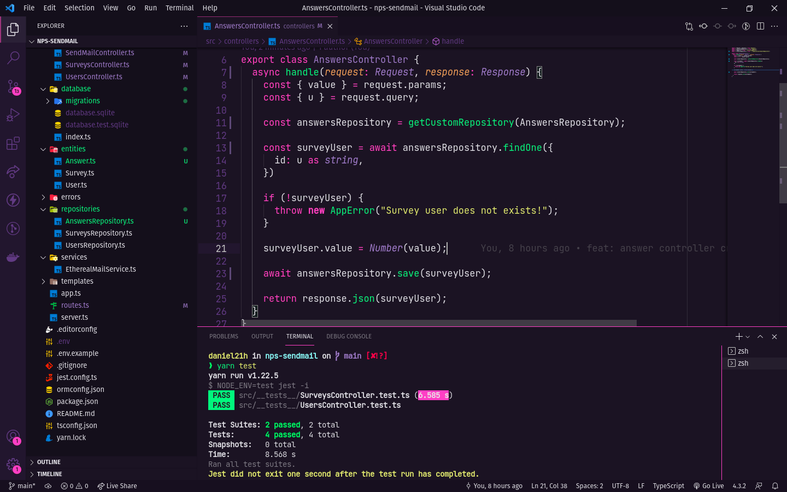

<center>

# NPS-SendMail



</center>

## 💻 Projeto

O NPS-NLW é uma aplicação que consiste em calcular o NPS da empresa. Nele fazemos o cadastro de usuários, cadastro de pesquisas, envio de e-mail para os usuários responderem as pesquisas de satisfação e com isso podemos realizar o cálculo do NPS.

Esse projeto foi desenvolvido durante a trilha de NodeJS, na quarta edição da NLW. Um projeto utilizando Typescript e Express para gerenciamento das rotas, TypeORM para manipulação dos dados, testes automatizados com Jest e envio de e-mail com Nodemailer e Ethereal em ambiente de teste.

## ✨ Tecnologias

Esse projeto foi desenvolvido com as seguintes tecnologias:

- [Node.js](https://nodejs.org/en/)
- [Express](https://expressjs.com/pt-br/)
- [TypeScript](https://www.typescriptlang.org/)
- [TypeORM](https://typeorm.io/#/)
- [Ethereal-Email](https://ethereal.email/)
- [Jest](https://jestjs.io/)
- [Yup](https://www.npmjs.com/package/yup?activeTab=readme)
- [SQL Editor Beekeeper Studio](https://www.beekeeperstudio.io/)

## 🔗 Requisitos básicos

Antes de começar, você precisará ter as seguintes ferramentas instaladas em sua máquina:
- [Git](https://git-scm.com)

O projeto pode ser construído com npm ou yarn, então escolha uma das abordagens abaixo caso você não tenha nenhum instalado em seu sistema.

O Npm é distribuído com o Node.js, o que significa que quando você faz o download do Node.js, o npm é instalado automaticamente no seu computador
- [Node.js v14.16.0](https://nodejs.org/) ou maior.

Yarn é um gerenciador de pacotes criado pela equipe do Facebook e parece ser mais rápido do que o npm em geral.
- [Yarn v1.22.5](https://yarnpkg.com/) ou maior.

Além disso, é bom ter um editor para trabalhar com o código, como [VSCode](https://code.visualstudio.com/).

## :information_source: Como executar

Siga as instruções abaixo para baixar e usar o projeto deste repositório:

```bash
# Clone this repository using SSH
$ git clone git@github.com:danielhessell/nps-sendmail.git
# or clone using https
$ git clone https://github.com/danielhessell/nps-sendmail.git

# Go into the repository
$ cd nps-sendmail

# Install dependencies
$ yarn

# Run migrations
$ yarn typeorm migration:run

# Run project
$ yarn dev:server

# Run project tests
$ yarn test
```

---

Made with :blue_heart: by [Daniel Hessel](https://www.linkedin.com/in/daniel-hessel-240731176/) :wave:
